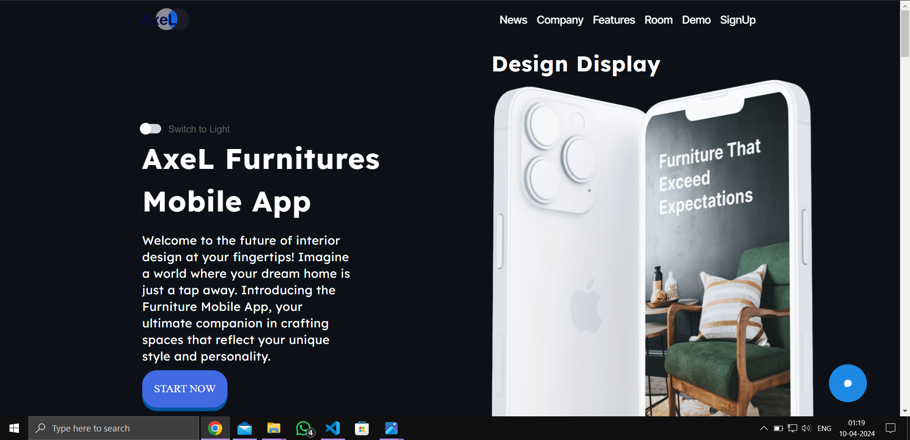

# Getting Started with Create React App

### `npm install react-scroll`

# Dependencies:

Material Tailwind:
### `npm i @material-tailwind/react`

React-animation:
### `npm install react-intersection-observer`

Framer-motion div:
### `npm install framer-motion`

In the project directory, you can run:

To run the same:
### `npm start`
